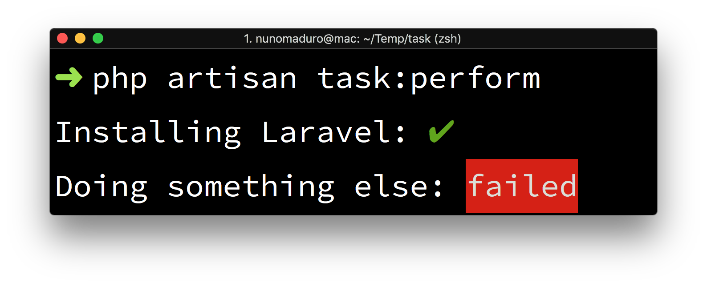

<p align="center">
    
</p>

<p align="center">
  <a href="https://styleci.io/repos/113789331"></img></a>
  <a href="https://packagist.org/packages/nunomaduro/laravel-console-task"></a>
  <a href="https://packagist.org/packages/nunomaduro/laravel-console-task"></a>
  <a href="https://packagist.org/packages/nunomaduro/laravel-console-task"></a>
</p>

## About Laravel Console Task

Laravel Console Task was created by, and is maintained by [Nuno Maduro](https://github.com/nunomaduro), and is output method for Laravel Console Commands.

## Installation

> **Requires:**
> - **[PHP 8.1+](https://php.net/releases)**
> - **[Laravel 9.0+](https://github.com/laravel/laravel)**

Require Laravel Console Task using [Composer](https://getcomposer.org):

```bash
composer require nunomaduro/laravel-console-task
```

## Usage

```php
class LaravelInstallCommand extends Command
{
    /**
     * Execute the console command.
     *
     * @return void
     */
    public function handle()
    {
        $this->task('Installing Laravel', function () {
            return true;
        });

        $this->task('Doing something else', function () {
            return false;
        });

        // Specify a 3rd parameter for a custom loading message
        // Default is `loading...`
        $this->task('Long task', function () {
            sleep(60);
            return true;
        }, 'sleeping...');
    }
}
```

## Contributing

Thank you for considering to contribute to Laravel Console Task. All the contribution guidelines are mentioned [here](CONTRIBUTING.md).

You can have a look at the [CHANGELOG](CHANGELOG.md) for constant updates & detailed information about the changes. You can also follow the twitter account for latest announcements or just come say hi!: [@enunomaduro](https://twitter.com/enunomaduro)

## License

Laravel Console Task is an open-sourced software licensed under the [MIT license](LICENSE.md).
